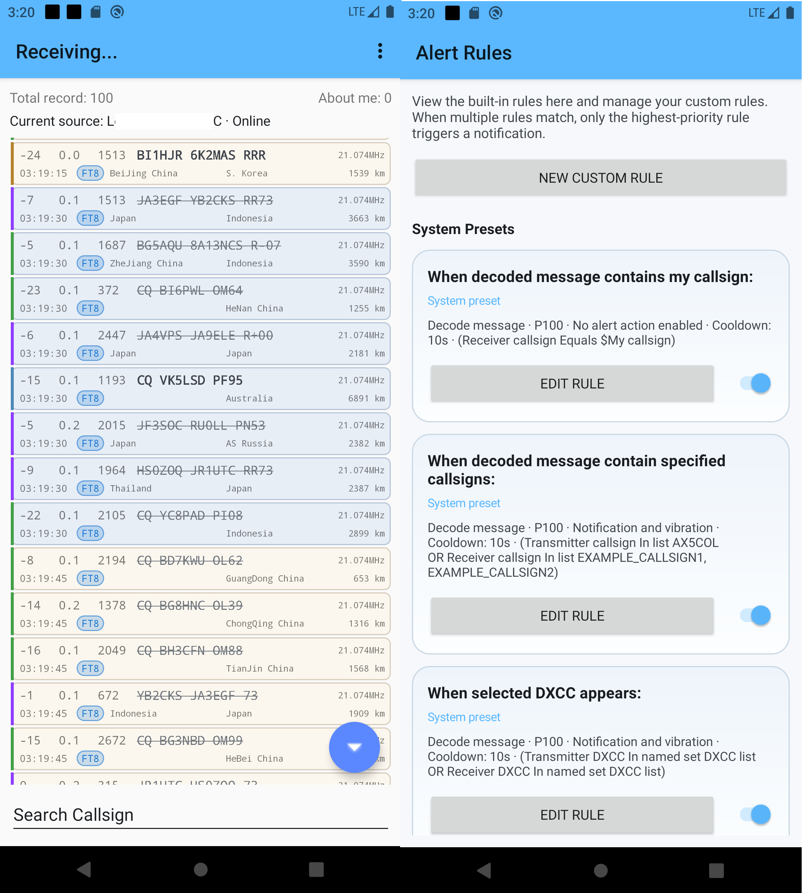
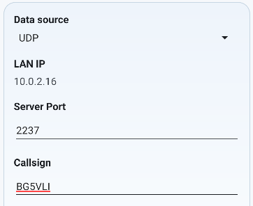
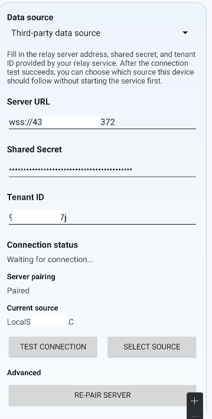
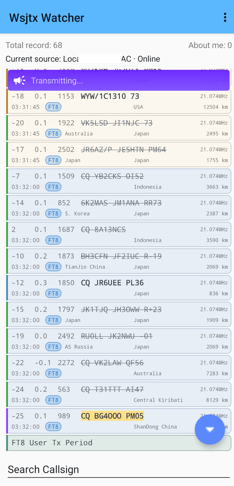
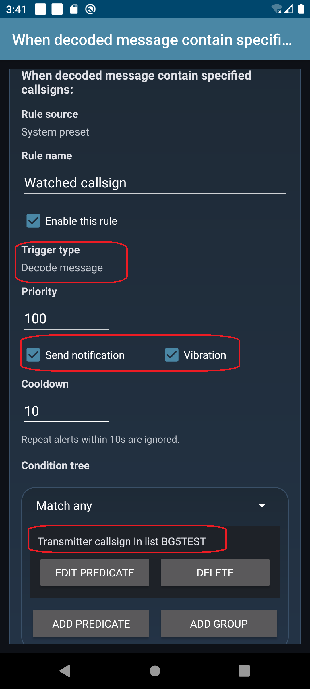
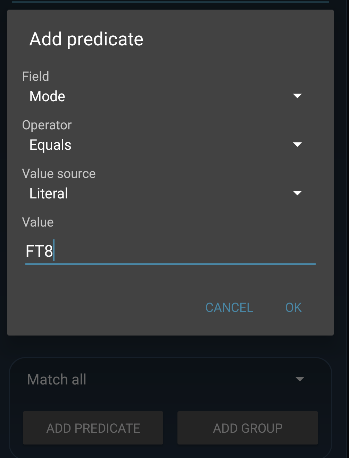
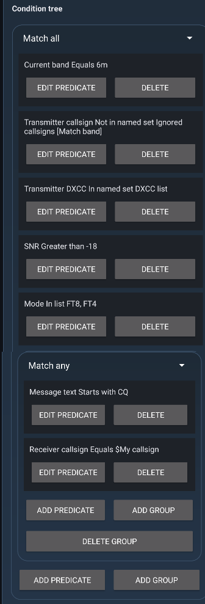

# WsjtxWatcher

`WsjtxWatcher` is an Android companion app for `WSJT-X` and `JTDX`. It lets you watch live decode traffic on your phone and receive notifications or vibration alerts when a message or logged QSO matches your configured rules.

Use cases:

- Daily station monitoring without staying glued to the computer screen
- Remote watching of off-site stations
- DX entity tracking and filtering
- VHF / 6m and other scenarios requiring continuous band activity awareness




Supported languages: Simplified Chinese, English

## Features

- Receive `WSJT-X` / `JTDX` decode data over local UDP, or from a remote station via `wsjtx-relay`
- Real-time decode message list
- Custom rule system: match decoded messages or logged QSOs against conditions, trigger notifications or vibration
- Maintain an ignored-callsign list, with manual entry or import from Cloudlog / Wavelog
- Auto-add worked callsigns to the ignored list after a logged QSO (with optional per-band matching)
- Maintain a reusable DXCC watch list that multiple rules can reference

## Requirements

- Android 8.0 or later

## Data Sources

The app supports two data source modes, switchable in Settings.

### Local UDP

Use this when your phone and the computer running `WSJT-X` / `JTDX` are on the same local network.

In this mode (similar to GridTracker), the app starts a UDP server on the phone and listens on a specified port. `WSJT-X` / `JTDX` sends decode data directly to the phone's IP and port. Default port is `2237`.



### Relay Mode

Use this for remote stations, when direct LAN access is unavailable, or when data needs to traverse a public network. See [wsjtx-relay](https://github.com/SydneyOwl/wsjtx-relay) for the relay protocol stack.

Deployment:

1. Deploy `wsjtx-relay-server` on a server with a public IP
2. Run `wsjtx-relay-client` on the computer that runs `WSJT-X` / `JTDX` to upload data to the relay server
3. Connect `WsjtxWatcher` on your phone to the relay server and select a source to follow

On the first successful connection, the app stores the server certificate fingerprint. If the server certificate changes later (e.g. the relay server was redeployed), use the **Re-pair server** function and test the connection again.



## Quick Start

### Option A: Local UDP

1. Open the app and go to **Settings**
2. Set **Data source** to `UDP`
3. Confirm the **Server port** (default `2237`)
4. Return to the main screen and tap **Start Service**
5. In `WSJT-X` or `JTDX`, set the UDP destination to the phone's displayed **LAN IP:Port**

> The phone and computer must be on the same LAN. The phone's IP may change when switching networks.

### Option B: Relay

1. Deploy and start `wsjtx-relay-server` and `wsjtx-relay-client` (see [wsjtx-relay](https://github.com/SydneyOwl/wsjtx-relay))
2. Open the app and go to **Settings**
3. Set **Data source** to `Third-party data source`
4. Fill in **Server URL**, **Shared Secret**, and **Tenant ID**
5. Tap **Test connection**
6. After the test succeeds, tap **Select source** and pick the target source. You do not need to start the service before selecting the source.
7. Return to the main screen and tap **Start Service**

## Main Screen

The main screen shows live monitoring status. Please note that we have following color logics:

- Row background color: separates alternating decode periods and distinguishes system / transmit entries
- Message-text highlight: indicates records that matched alert rules without recoloring the whole row
- Left indicator bar: provides quick status scanning, such as alert-rule matches or ignored callsigns




## Settings

### Common

| Setting | Description |
|---------|-------------|
| My Callsign | Your callsign, used by built-in rules |
| My Grid | Maidenhead grid square, e.g. `OM89` |
| Language | UI language |
| Theme | Follow system / Light / Dark |
| Auto-ignore after QSO | Automatically add the worked callsign to the ignored list after a logged QSO |

Filling in **My Callsign** correctly is important — the built-in **My callsign** rule depends on it to detect when someone is calling you.

### UDP Settings

| Setting | Description |
|---------|-------------|
| LAN IP | Phone's current LAN IP (display only) |
| Server Port | UDP port the app listens on, default `2237` |

This shows the phone's listening address. The computer running `WSJT-X` / `JTDX` should send UDP data to this address.

### Relay Settings

| Setting | Description |
|---------|-------------|
| Server URL | Relay server address, e.g. `wss://example.com:8443` |
| Shared Secret | Authentication secret for the relay connection |
| Tenant ID | Shared isolation identifier used by both the uploader and watcher |
| Relay status | Current relay connection state |
| Test connection | Validate the URL, certificate, and authentication |
| Select source | Choose which data source to follow |
| Refresh source list | Reload the source catalog |
| Re-pair server | Clear the stored certificate fingerprint and re-establish trust |

## Rule System

The rule system is the core of the app. Access it via **Settings → Configure alert rules**.

Each rule defines a condition → action flow: when a decoded message or QSO log satisfies the conditions, the specified actions (notification / vibration) are performed.

for example following picture shows a preset rule which sends notification and vibrates when a message is decoded and has a transmitter callsign equals to BG5TEST (DE callsign, e.g. `JA1AAA BG5TEST OL12` )

**see `Rule Configuration Examples`  for more.**




### Trigger Types

- **Decode message rule**: checked each time a new decoded message arrives
- **Logged QSO rule**: checked each time `WSJT-X` / `JTDX` reports a logged QSO

### Actions

Each rule can enable one or both of:

- Send notification
- Vibration

At least one action must be enabled for the rule to produce a noticeable alert.

### Priority

When multiple rules match at the same time, only the highest-priority rule (lowest `Priority` number) triggers.

### Cooldown

Prevents the same rule from firing repeatedly within a short window. For example, a cooldown of `10` seconds means the rule will not trigger again for 10 seconds after it fires.

### Condition Tree

Rule conditions are composed of **condition groups** and **predicates**, with support for nesting to express complex filtering logic.

#### Predicates

A predicate is a `field + operator + value` combination. For example:



| Field | Operator | Value |
|-------|----------|-------|
| Mode | Equals | FT8 |

This matches only when the decoded message mode is FT8.

#### Condition Groups

A group determines how its child conditions are combined:

- **Match all**: every child condition must be true (AND)
- **Match any**: at least one child condition must be true (OR)

Groups can be nested, enabling complex logic such as `(A AND B) OR (C AND D)`.

### Decode Message Rule Fields

| Field | Description |
|-------|-------------|
| Message text | Full text of the decoded message |
| Transmitter callsign | Callsign of the transmitting station |
| Receiver callsign | Callsign of the receiving station |
| Mode | e.g. FT8, FT4 |
| SNR | Signal-to-noise ratio (dB) |
| Offset frequency | Frequency offset (Hz) |
| Offset time | Time offset (seconds) |
| Dial frequency | Radio dial frequency (Hz) |
| Current band | e.g. 20m, 40m |
| Transmitter grid | Maidenhead grid square |
| From country ID | DXCC entity number of the transmitter |
| To country ID | DXCC entity number of the receiver |
| Is low confidence | Decode has low confidence |
| Is off air | Signal not received over the air (e.g. from a local audio file) |
| Is user transmit | Message transmitted by the local station |
| Is system notice | WSJT-X system message |

### Logged QSO Rule Fields

| Field | Description |
|-------|-------------|
| Logged QSO callsign | Callsign of the worked station |
| Logged QSO band | Band of the QSO |

### Common Operators

| Operator | Description |
|----------|-------------|
| Equals / NotEquals | Exact match |
| Contains / NotContains | Substring match |
| StartsWith / EndsWith | Prefix / suffix match |
| Regex | Regular expression match |
| GreaterThan / LessThan | Numeric comparison |
| In / NotIn | Set membership match |
| InNamedSet / NotInNamedSet | Reference the DXCC list or Ignored callsigns list |
| Exists / NotExists | Check whether a field has a value |

## Named Sets

Named sets are reusable global lists that multiple rules can reference — maintain in one place, use everywhere. Two types are supported:

### Ignored Callsigns

Access via **Settings → Ignored callsigns**. Essentially a "don't alert me about these stations again" list.

Maintenance:

- Manually add callsigns and bands
- Import historical QSO data from Cloudlog / Wavelog

Matching modes:

- **Match by band**: only ignore the station on the specific band worked; alerts on other bands still fire
- **Ignore regardless of band**: suppress alerts for the callsign on all bands

Combined with the **Auto-ignore after QSO** option, the ignored list can be maintained automatically as you log QSOs.

### DXCC Watch List

Select the DXCC entities you care about in Settings, then reference them in rules via `InNamedSet → DXCC list`. No need to duplicate the same entity conditions across multiple rules.

## Built-in Rules

The app ships with five system rules that you can use as-is or modify:

| Rule | Condition | Default |
|------|-----------|---------|
| My callsign | Receiver callsign equals your callsign | Enabled |
| Watched callsign | Transmitter or receiver callsign matches watched criteria | Enabled |
| Selected DXCC | Transmitter or receiver country is in the DXCC list | Enabled |
| Logged QSO | A QSO has been logged | Enabled |
| Any message | Any decoded message | Disabled |

## Rule Configuration Examples

### VHF DX Alert

We plan to achieve the following goals: we will focus only on FT8/FT4 modes on the 6-meter band, and the other station must be a target in my DXCC list, not a callsign you have already worked and ignored. Additionally, they must either be calling CQ or calling you, and the signal should not be too weak.

our goal should be equal to this:

``````bash
CurrentBand == "6m"
  && (Mode == "FT8" || Mode == "FT4")
  && TransmitterCallsign NOT IN IgnoredCallsigns
  && TransmitterDXCC IN DxccList
  && (MessageText STARTS_WITH "CQ" || ReceiverCallsign == MyCallsign)
  && SNR >= -18
``````

Condition tree is supposed to be like this:




## Importing from Cloudlog / Wavelog

The ignored callsign list supports importing historical QSOs from Cloudlog or Wavelog.

Required information:

- Site URL
- Station ID
- Username
- Password
- Lookback days

The import downloads ADIF data for the specified time range, extracts `CALL` and `BAND` fields, and generates per-band ignored entries.

Example configuration:

| Field | Example |
|-------|---------|
| URL | `https://log.example.com` |
| Station ID | `1` |
| Username | `bg7xxx` |
| Lookback days | `3650` |

## Notes

- When multiple rules match simultaneously, only the highest-priority rule triggers
- A rule must have at least one action enabled to produce an alert
- After relay reconnect, the app receives current state and a snapshot — historical messages are not replayed
- Android background restrictions may affect continuous operation; disabling battery optimization is recommended
- If the relay server certificate changes, use **Re-pair server** and test the connection again

## Acknowledgments

- [ft8cn](https://github.com/N0BOY/FT8CN) — some UI configurations and utility classes were adapted from this project
- [WsjtxUtils](https://github.com/KC3PIB/WsjtxUtils) — WSJT-X UDP message handling library

## License

This project is released under [The Unlicense](https://unlicense.org). It is free and unencumbered software released into the public domain — anyone is free to copy, modify, publish, use, compile, sell, or distribute it for any purpose.
