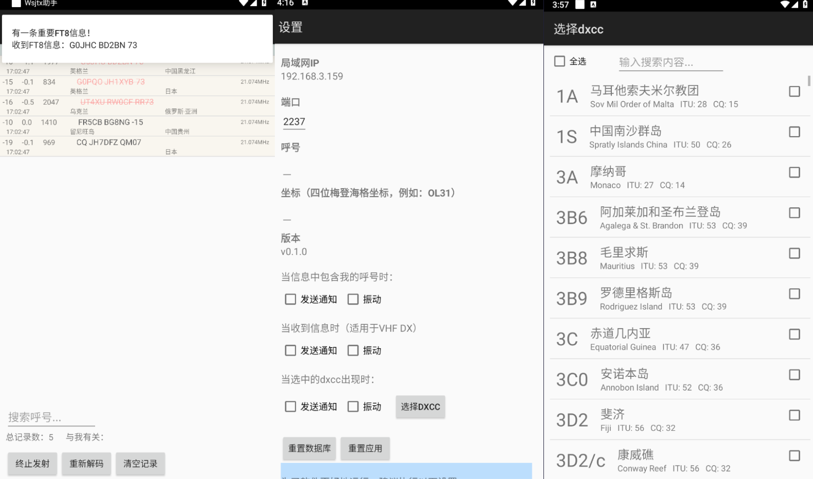
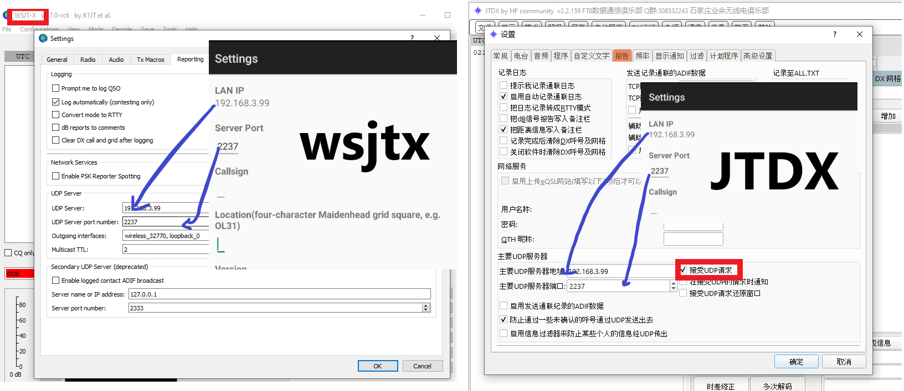

# WsjtxWatcher


[Read it in English](./readme_en.md)

## 简介

本软件利用`Wsjtx`(或`JTDX`，以下均称`wsjtx`)内置的UDP服务器功能，实现了与wsjtx的数据交互，用户可在软件中查看实时的ft8信息，并可进行取消发送、设置提醒等操作（**部分功能在低版本jtdx上不可用！**），也可指定需要发送通知进行提醒的场景，尤其适合VHF DX。

当软件处于前台运行时，您可以实时查看收到的FT8信息；当软件进入后台，或手机锁屏时，软件将根据您的设置，在收到指定FT8信息时向您推送。

目前支持简体中文和英语两种语言。



## 支持的系统版本

+ Android 8.0+

## 使用方法

**注意：使用前，如果您的手机开启了省电模式，请务必关闭，否则将造成频繁断联！！**

1. 点击右上角菜单，选择进入设置页面，在设置页面中填写呼号以及梅登海格坐标，并按需修改其他设置。请记下设置页中展示的ip地址和端口号。

2. 回到主界面后，再次点击右上角菜单，点击“开启服务”。

3. 在电脑的jtdx/wsjtx软件中填写对应的ip和端口，如下图所示：

   

   并请勾选“接受UDP请求”！

   **确保运行wsjtx的电脑与手机在同一个局域网环境中，例如连接着同一个wifi!**

4. 等待信息在软件界面中出现！

## Todos

+ 增加更多的信息支持（ft4/wspr）
+ 其他...

## 致谢

+ [ft8cn](https://github.com/N0BOY/FT8CN)项目，借鉴了一些界面的配置以及一些工具类，也从其中学到了不少开发知识，感谢！
+ [WsjtxUtils](https://github.com/KC3PIB/WsjtxUtils)，也是我没有选择用java开发的原因，因为没有合适的wsjtx解码库！

## 版本日志

`v0.0.1` Demo版本的WsjtxWatcher

`v0.1.0` 加入呼号搜索、自定义DXCC以及其他功能，修正了一堆bug，优化数据库结构以及读写速度。

## 许可证

本项目使用`The Unlicense`进行许可。

```markdown
This is free and unencumbered software released into the public domain.

Anyone is free to copy, modify, publish, use, compile, sell, or
distribute this software, either in source code form or as a compiled
binary, for any purpose, commercial or non-commercial, and by any
means.

In jurisdictions that recognize copyright laws, the author or authors
of this software dedicate any and all copyright interest in the
software to the public domain. We make this dedication for the benefit
of the public at large and to the detriment of our heirs and
successors. We intend this dedication to be an overt act of
relinquishment in perpetuity of all present and future rights to this
software under copyright law.

THE SOFTWARE IS PROVIDED "AS IS", WITHOUT WARRANTY OF ANY KIND,
EXPRESS OR IMPLIED, INCLUDING BUT NOT LIMITED TO THE WARRANTIES OF
MERCHANTABILITY, FITNESS FOR A PARTICULAR PURPOSE AND NONINFRINGEMENT.
IN NO EVENT SHALL THE AUTHORS BE LIABLE FOR ANY CLAIM, DAMAGES OR
OTHER LIABILITY, WHETHER IN AN ACTION OF CONTRACT, TORT OR OTHERWISE,
ARISING FROM, OUT OF OR IN CONNECTION WITH THE SOFTWARE OR THE USE OR
OTHER DEALINGS IN THE SOFTWARE.

For more information, please refer to <https://unlicense.org>
```


