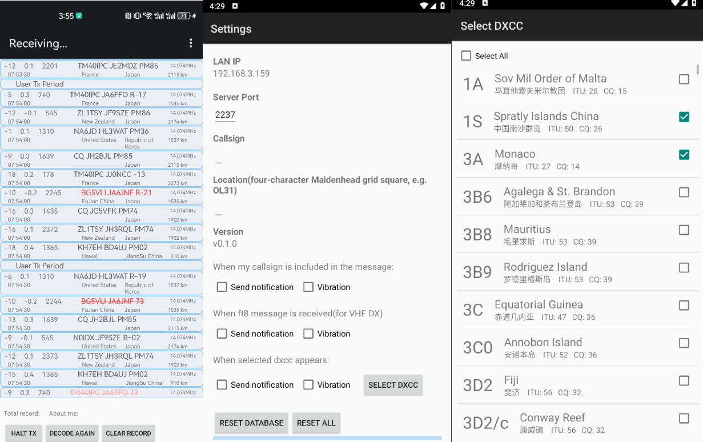

# WsjtxWatcher

## Introduction

This software utilizes the UDP server functionality built into `Wsjtx` (or `JTDX`, hereafter referred to as `wsjtx`) to enable data interaction with wsjtx. Users can view real-time FT8 information within the software, and perform actions such as canceling transmission and setting reminders (**some features may not be available on older versions of JTDX!**). You can also specify scenarios that require notifications, making it especially suitable for VHF DX.

When the software is running in the foreground, you can view the received FT8 information in real time. When the software goes to the background or the phone is locked, the software will push notifications to you when receiving specified FT8 information based on your settings.

Currently, the software supports Simplified Chinese and English.



## Supported System Versions

+ Android 8.0 and above

## How to Use

**Note: Before using the software, if your phone has battery saver mode enabled, please make sure to disable it. Otherwise, it may cause frequent disconnections!**

1. Click the menu in the upper-right corner and select the settings page. Enter your callsign and Maidenhead locator
   coordinates on the settings page, and adjust other settings as needed. Note the IP address and port number displayed
   on this page.

2. Return to the main interface and click the menu again, then select "Start Service."

3. In your computer's JTDX/WSJTX software, enter the corresponding IP address and port number as shown below:

   

   **Ensure that the computer running wsjtx and your phone are on the same local network, such as being connected to the
   same Wi-Fi!**

4. Wait for the information to appear on the software interface!

## Todos

+ Add support for more message types
+ Other enhancements...

## Acknowledgments

+ Thanks to the [ft8cn](https://github.com/N0BOY/FT8CN) project, from which some interface configurations and utility
  classes were borrowed. I have also gained considerable development knowledge from it.
+ Appreciation to [WsjtxUtils](https://github.com/KC3PIB/WsjtxUtils) for highlighting the lack of suitable wsjtx
  decoding libraries, influencing the choice not to develop in Java.

## License

This project is licensed under `The Unlicense`.

``````
This is free and unencumbered software released into the public domain.

Anyone is free to copy, modify, publish, use, compile, sell, or
distribute this software, either in source code form or as a compiled
binary, for any purpose, commercial or non-commercial, and by any
means.

In jurisdictions that recognize copyright laws, the author or authors
of this software dedicate any and all copyright interest in the
software to the public domain. We make this dedication for the benefit
of the public at large and to the detriment of our heirs and
successors. We intend this dedication to be an overt act of
relinquishment in perpetuity of all present and future rights to this
software under copyright law.

THE SOFTWARE IS PROVIDED "AS IS", WITHOUT WARRANTY OF ANY KIND,
EXPRESS OR IMPLIED, INCLUDING BUT NOT LIMITED TO THE WARRANTIES OF
MERCHANTABILITY, FITNESS FOR A PARTICULAR PURPOSE AND NONINFRINGEMENT.
IN NO EVENT SHALL THE AUTHORS BE LIABLE FOR ANY CLAIM, DAMAGES OR
OTHER LIABILITY, WHETHER IN AN ACTION OF CONTRACT, TORT OR OTHERWISE,
ARISING FROM, OUT OF OR IN CONNECTION WITH THE SOFTWARE OR THE USE OR
OTHER DEALINGS IN THE SOFTWARE.

For more information, please refer to <https://unlicense.org>
``````

